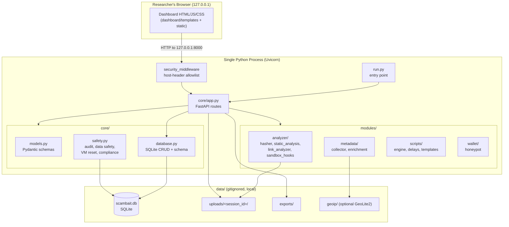
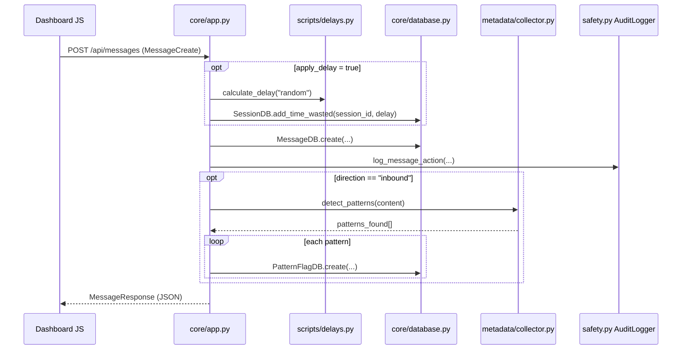

# Architecture

This document describes the internal architecture of the **Scambait Research
Toolkit** for new contributors. It is grounded in the actual code in this
repository — every component named below maps to a real module.

For a user-facing overview (features, setup, configuration), see the
[README](../README.md).

---

## 1. Overview

The toolkit is a single-process, **local-only** [FastAPI](https://fastapi.tiangolo.com/)
web application. It serves two things from one Python process bound to
`127.0.0.1`:

1. A **server-rendered dashboard** (Jinja2 templates + static JS/CSS) for a
   human researcher.
2. A **JSON API** (`/api/...`) that the dashboard's JavaScript calls, and that
   is also documented via automatic Swagger docs at `/api/docs`.

All state lives in a local SQLite database and a local `data/` directory. There
are **no outbound network calls** by design — file, link, and pattern analysis
are all performed offline. A host-header allowlist and a hardcoded bind address
enforce the localhost-only posture.

**Runtime shape:**

- Language: Python 3.10+
- Web framework: FastAPI on Uvicorn (ASGI)
- Persistence: SQLite via `aiosqlite` (async)
- Validation/serialization: Pydantic v2
- Templating: Jinja2 (server-rendered HTML) + vanilla JS (no build step)

---

## 2. High-Level Diagram

---

## 3. Request / Data Flow

Every HTTP request follows the same top-level path:

1. **Uvicorn** receives the request (bound to `127.0.0.1:PORT` from
   `run.py` / `config.py`).
2. **`security_middleware`** (in `core/app.py`) calls
   `validate_request_safety()` from `core/safety.py`, which checks the `Host`
   header against `config.ALLOWED_HOSTS` (`127.0.0.1`, `localhost`). Non-allowed
   hosts get a `403` and a `security.blocked_host` audit entry.
3. The matched **route handler** in `core/app.py` runs. HTML routes return a
   Jinja2 template; `/api/...` routes validate input with **Pydantic models**
   (`core/models.py`), call into `core/database.py` and/or a `modules/`
   component, write an **audit-log** entry via `core/safety.py:AuditLogger`,
   and return a Pydantic response model serialized to JSON.
4. **`core/database.py`** opens a short-lived async SQLite connection per
   operation (`get_db_context()`), executes the query, and returns plain dicts.

### Example: inbound message with auto pattern-detection

`POST /api/messages` (see `create_message` in `core/app.py`) is the richest
flow and shows how the pieces compose:

Key behaviors worth knowing:

- `detect_patterns()` (in `modules/metadata/collector.py`) is a pure keyword
  matcher over `config.SCAM_PATTERNS` (urgency / authority / fear / greed /
  social_proof / reciprocity). It computes a confidence per category and a
  `risk_level` (`low`/`medium`/`high`). It makes **no** network calls.
- Delays are cosmetic time-wasting suggestions; the app records
  `total_time_wasted_seconds` per session but does not itself message anyone.

### Example: file upload and static analysis

`POST /api/upload` (see `upload_file` in `core/app.py`):

1. `DataSafety.validate_file_extension()` checks the extension against
   `config.ALLOWED_UPLOAD_EXTENSIONS` (executables are allowed **for analysis
   only**, never run).
2. `DataSafety.generate_safe_storage_name()` derives a hashed storage filename;
   the raw bytes are written under `data/uploads/<session_id>/`.
3. Size is enforced against `config.MAX_UPLOAD_SIZE_BYTES` (10 MB default).
4. `modules/analyzer/hasher.py:hash_file()` computes MD5 / SHA-1 / SHA-256.
5. `modules/analyzer/static_analysis.py:analyze_file()` detects the true type
   from magic bytes and runs a type-specific **static** inspector (PE, archive,
   PDF, Office, HTML) that flags suspicious traits **without executing anything**.
6. An `attachments` row is written with the hashes, the analysis JSON, and an
   `is_malicious` flag derived from `analysis.is_suspicious`.

---

## 4. Component Breakdown

### Entry point

| File | Responsibility |
| --- | --- |
| `run.py` | Prints a safety banner, then starts Uvicorn on `core.app:app` at `config.HOST:PORT`. Reload is disabled deliberately (security). |
| `config.py` | Single source of truth for all settings. Creates `data/` subdirs on import, defines the SQLite URL, the localhost bind, the honeypot config, upload limits, delay ranges, and the `SCAM_PATTERNS` keyword table. Reads a few env vars (port, honeypot display values); **`HOST` is intentionally not env-overridable**. |

### `core/` — application core

| File | Responsibility |
| --- | --- |
| `core/app.py` | The FastAPI app: lifespan (DB init + startup/shutdown audit), CORS (local origins only), static-file mount, Jinja2 templates, the `security_middleware`, and **all** HTML + API routes. This is the primary router. |
| `core/models.py` | All Pydantic v2 models and enums (`SessionStatus`, `MessageDirection`, `ScamType`, `PatternType`) plus request/response schemas for sessions, messages, attachments, pattern flags, scripts, wallet display, reports, dashboard stats, and audit entries. |
| `core/database.py` | SQLite schema (`SCHEMA_SQL`), `init_db()` (creates tables + seeds default scripts), an async connection context manager, and static CRUD classes: `SessionDB`, `MessageDB`, `AttachmentDB`, `AuditDB`, `PatternFlagDB`, `ScriptDB`. |
| `core/safety.py` | The safety/compliance layer: `AuditLogger` (structured audit events), `NetworkSafety` (host allowlist, local-address checks), `DataSafety` (path-traversal-safe filenames, extension/size validation), `VMResetManager` (`prepare-snapshot`, `full-wipe`, `selective-wipe`), `ComplianceReporter` (audit-report export), and `validate_request_safety()` used by the middleware. |

### `modules/` — feature modules

| Module | Files | Responsibility |
| --- | --- | --- |
| `modules/analyzer/` | `hasher.py` | MD5/SHA-1/SHA-256 hashing of files, bytes, and streams; a small local known-hash table (EICAR test file, empty file); optional `ssdeep` fuzzy hashing (degrades to no-op if not installed). |
| | `static_analysis.py` | Magic-byte file-type detection (optionally aided by `filetype` / `python-magic`) and non-executing inspectors for PE, ZIP/RAR/7z archives, PDF, Office (macro/DDE detection), and HTML (script/iframe/eval heuristics). Also string extraction and suspicious-string matching. |
| | `link_analyzer.py` | URL **defanging**/refanging, and heuristic link analysis (IP-literal hosts, abused TLDs, typosquatting, long URLs, encoded params, base64 params, homograph/mixed-script domains, suspicious paths, redirect params). Never fetches the URL. |
| | `sandbox_hooks.py` | Optional integration *interface* for an external sandbox (`SandboxInterface` ABC, `SandboxResult`, `SandboxManager` singleton). Ships with a **stub** (`LocalSandboxStub`) that performs no real execution and is wired in by default. No external service is contacted. |
| `modules/metadata/` | `collector.py` | Captures request metadata (headers, UA, IP), generates fingerprints, runs `detect_patterns()`, `analyze_language_patterns()`, timing/engagement analysis, and `generate_session_report()` (the export payload). |
| | `enrichment.py` | User-agent parsing (`user-agents`), optional **offline** GeoIP lookup via a local GeoLite2 `.mmdb` in `data/geoip/` (falls back to private/loopback/public classification if absent), and HTTP-header analysis (proxy/CDN hints, client hints, language prefs). |
| `modules/scripts/` | `engine.py` | Persona/response engine. Holds `DEFAULT_SCRIPTS` (four personas), seeds them into the `scripts` table on init, and `get_suggested_response()` matches recent context to a persona's trigger→responses set and attaches a delay. Suggestions are for a **human** operator to send manually. |
| | `delays.py` | Realistic time-wasting delay math: named `DELAY_PATTERNS` (phone call, finding glasses, spouse consultation, etc.), `calculate_delay()`, progressive delays, typing simulation, and interruption sequences. |
| | `templates/*.json` | The four persona definitions on disk (`confused_elderly`, `overly_eager`, `suspicious_but_curious`, `tech_illiterate`). |
| `modules/wallet/` | `honeypot.py` | Generates the **fake** wallet display: fake balances/tokens/transactions, fake connection/transaction "simulation" steps (designed to stall), and logs scammer interactions to the `wallet_interactions` table. No real funds, no address the operator controls. |

### `dashboard/` — presentation layer

| Path | Responsibility |
| --- | --- |
| `dashboard/templates/*.html` | Server-rendered pages: `base.html` (sidebar shell + New-Session modal), `dashboard.html`, `session.html`, `analysis.html`, `reports.html`, `wallet_display.html`. |
| `dashboard/static/js/*.js` | Vanilla JS (no framework/build): `app.js` (session creation, modals, toasts, `apiCall` helper, health check), plus `charts.js` and `timeline.js` for visualizations. |
| `dashboard/static/css/styles.css` | All styling. |
| `dashboard/routes.py` | An `APIRouter` with helper routes (`/dashboard/help`, `/dashboard/settings`) and a `get_template_context()` helper. Note: the primary routes live in `core/app.py`; this router is a supplementary helper and its templates are not part of the core set. |

### `tests/`

`tests/` currently contains only a package `__init__.py` — a scaffold. There is
no meaningful suite yet; `pytest` and `pytest-asyncio` are already declared in
`requirements.txt`.

---

## 5. Data Stores

All persistent state is local and lives under `data/` (gitignored). Directories
are created automatically by `config.py` on import.

### SQLite database — `data/scambait.db`

Schema is defined in `core/database.py:SCHEMA_SQL` (schema version 1). Tables:

| Table | Purpose | Notable columns / notes |
| --- | --- | --- |
| `sessions` | One baiting/research session. | `status` (`active`/`paused`/`completed`/`archived`), `scam_type`, `script_id`, `total_time_wasted_seconds`. |
| `messages` | Inbound/outbound messages within a session. | `direction`, `content`, `delay_applied_seconds`; `ON DELETE CASCADE` from `sessions`. |
| `attachments` | Uploaded files and their static-analysis results. | `md5_hash`, `sha1_hash`, `sha256_hash`, `analysis_result` (JSON), `is_malicious`. |
| `pattern_flags` | Detected scam-pattern hits. | `pattern_type`, `confidence`, `evidence`. |
| `metadata` | Captured request metadata per session. | `ip_address`, `user_agent`, `headers`/`geo_data` (JSON), `fingerprint`. |
| `links` | URL/link tracking. | `original_url`, `defanged_url`, `domain`, `is_malicious`. |
| `scripts` | Persona/baiting scripts. | Seeded from `DEFAULT_SCRIPTS` on init; `responses`/`delay_config` stored as JSON. |
| `wallet_interactions` | Honeypot interaction log. | `action`, `details` (JSON), `ip_address`. |
| `audit_log` | Compliance audit trail. | `action`, `details` (JSON), `user_id` (default `researcher`). |
| `schema_version` | Migration bookkeeping. | Single row, version `1`. |

Indexes exist on the common lookup columns (session id, status, timestamps,
hashes, pattern/audit types).

### Filesystem directories (under `data/`)

| Directory | Contents |
| --- | --- |
| `data/uploads/<session_id>/` | Raw uploaded files, stored under hashed filenames. |
| `data/exports/` | Exported session reports and audit reports (JSON). |
| `data/geoip/` | Optional `GeoLite2-City.mmdb` for offline GeoIP (not shipped). |

`VMResetManager.full_wipe()` deletes the DB and the `uploads/`/`exports/`
directories, then reinitializes the database — supporting clean VM snapshots.

---

## 6. External Services and APIs

By design, this tool contacts **no external services at runtime**:

- `config.OUTBOUND_BLOCKED = True` documents the posture; the code performs no
  outbound HTTP/API calls in any analysis path.
- Link analysis **defangs and inspects** URLs but never fetches them.
- GeoIP is resolved from a **local** GeoLite2 database if present; otherwise it
  falls back to a basic private/loopback/public classification. The database is
  supplied by the user and is not downloaded by the app.
- `sandbox_hooks.py` defines an interface for an external sandbox but ships a
  no-op stub; no sandbox is contacted unless a contributor explicitly
  implements and configures one.

External dependencies are all **Python libraries** (see `requirements.txt`), not
network services:

| Dependency | Role | Optional? |
| --- | --- | --- |
| `fastapi`, `uvicorn`, `python-multipart`, `jinja2` | Web framework, ASGI server, form/upload parsing, templating | Required |
| `aiosqlite` | Async SQLite driver | Required |
| `pydantic` | Validation / serialization | Required |
| `user-agents` | UA parsing in `metadata/enrichment.py` | Required |
| `python-dotenv` | `.env` loading in `config.py` | Optional (config degrades gracefully) |
| `filetype`, `python-magic` / `python-magic-bin` | Magic-byte type detection in `static_analysis.py` | Optional (falls back to built-in magic-byte table) |
| `geoip2` | Reading a local GeoLite2 DB in `enrichment.py` | Optional |
| `ssdeep` | Fuzzy hashing in `hasher.py` | Optional |
| `pytest`, `pytest-asyncio`, `black`, `isort` | Dev/test tooling | Optional |

---

## 7. Safety Model (architectural)

The localhost-only, zero-outbound posture is enforced at several layers, which
new contributors should preserve:

1. **Bind address** — `config.HOST` is hardcoded to `127.0.0.1` and is *not*
   read from the environment. Only `PORT` is configurable.
2. **Host allowlist** — `security_middleware` rejects any request whose `Host`
   header is not in `config.ALLOWED_HOSTS` and logs a security audit event.
3. **CORS** — restricted to `http://127.0.0.1:8000` / `http://localhost:8000`.
4. **No execution** — uploaded files are only hashed and statically inspected;
   the honeypot references no remote assets (token logos are intentionally empty
   so the page makes no outbound requests).
5. **Path-traversal defense** — `DataSafety` sanitizes filenames, generates
   hashed storage names, and validates that export paths stay inside `data/`.
6. **Auditability** — `AuditLogger` records significant actions to `audit_log`,
   exportable via `ComplianceReporter` for review.
7. **Resettability** — `VMResetManager` supports snapshot prep and full/selective
   wipes for disposable-VM workflows.

---

## 8. Where to Start (for contributors)

- **Add or change an API endpoint** → `core/app.py` (route) + `core/models.py`
  (schemas) + the relevant `core/database.py` CRUD class.
- **Change persistence** → `core/database.py` (`SCHEMA_SQL` + the matching
  `*DB` class). Bump `SCHEMA_VERSION` if you alter the schema.
- **Add a detection heuristic** → `modules/analyzer/` (files/links) or
  `modules/metadata/collector.py` (`detect_patterns` / `SCAM_PATTERNS` in
  `config.py`).
- **Add or edit a persona** → `modules/scripts/engine.py` (`DEFAULT_SCRIPTS`)
  and/or `modules/scripts/templates/*.json`.
- **Touch safety/compliance behavior** → `core/safety.py` (and keep the
  localhost/zero-outbound guarantees intact).
